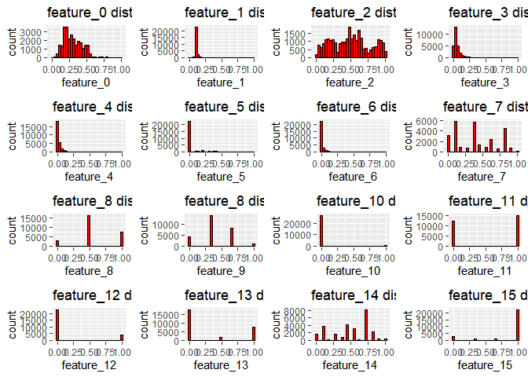
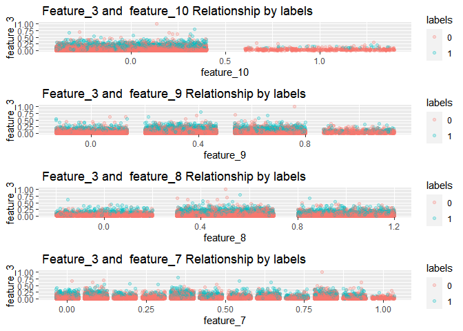

```r
# installing all required packages
#install.packages('plyr', repos="http://cran.rstudio.com/")
#install.packages('ggplot2', repos="http://cran.rstudio.com/")
#install.packages('psych')
#install.packages('gridExtra')
#install.packages('ISLR')
#install.packages('MASS')
#install.packages('caret', repos="http://cran.rstudio.com/")
#install.packages('car')
#install.packages('psych')
```


```r
library(psych)
library(gridExtra) 
library(ggplot2)
```

```
## 
## Attaching package: 'ggplot2'
```

```
## The following objects are masked from 'package:psych':
## 
##     %+%, alpha
```

```r
library(car)
```

```
## Loading required package: carData
```

```
## 
## Attaching package: 'car'
```

```
## The following object is masked from 'package:psych':
## 
##     logit
```

```r
library(caret)
```

```
## Loading required package: lattice
```

```r
library(tidyverse) 
```

```
## -- Attaching packages --------------------------------------- tidyverse 1.3.1 --
```

```
## v tibble  3.1.2     v dplyr   1.0.6
## v tidyr   1.1.3     v stringr 1.4.0
## v readr   1.4.0     v forcats 0.5.1
## v purrr   0.3.4
```

```
## -- Conflicts ------------------------------------------ tidyverse_conflicts() --
## x ggplot2::%+%()   masks psych::%+%()
## x ggplot2::alpha() masks psych::alpha()
## x dplyr::combine() masks gridExtra::combine()
## x dplyr::filter()  masks stats::filter()
## x dplyr::lag()     masks stats::lag()
## x purrr::lift()    masks caret::lift()
## x dplyr::recode()  masks car::recode()
## x purrr::some()    masks car::some()
```

```r
library(magrittr)
```

```
## 
## Attaching package: 'magrittr'
```

```
## The following object is masked from 'package:purrr':
## 
##     set_names
```

```
## The following object is masked from 'package:tidyr':
## 
##     extract
```

```r
library(MASS)
```

```
## 
## Attaching package: 'MASS'
```

```
## The following object is masked from 'package:dplyr':
## 
##     select
```

```r
library(psych)
```

# Introduction:
This assignment is to perform exploratory data analysis on insurance data followed by appropriate modelling to predict whether a customer of a insurance company will stay or leave. Sixteen distinguishing factors are given in the data-set in understanding the customer churn. Two data-sets are given:

  a) trainSet.csv which contains 27126 observations

  b) testSet.csv which contains 6782 observations

  So, trainSet data will be used to perform exploratory analysis and training the model. Two distinguished models will be build-up using training data. On the other hand, testSet.csv will be used for identifying model accuracy and selecting better model.


```r
insurance1 <- read.csv('trainSet.csv', header = TRUE, sep = ',')
testset <- read.csv('testSet.csv', header = TRUE, sep = ',')
```


```r
head(insurance1)
```

```
##    feature_0  feature_1  feature_2   feature_3   feature_4  feature_5
## 1  1.5127910 -0.2434605  0.1434182  2.01858846  0.07622994 -0.4114531
## 2 -1.5007763 -0.2125875  1.2248391 -0.15984112 -0.56935064 -0.4114531
## 3  0.9477471  0.5812426 -0.3372133  0.77987360 -0.56935064 -0.4114531
## 4 -0.8415585 -0.2217837  0.5038918 -0.37729577  0.39902023 -0.4114531
## 5 -0.5590365 -0.5922597 -1.1783185 -0.41612696 -0.56935064 -0.4114531
## 6  0.9477471 -0.4654833 -0.5775291  0.08867847 -0.24656035  2.2551433
##    feature_6 feature_7 feature_8 feature_9 feature_10 feature_11 feature_12
## 1 -0.2519404         1         1         1          0          1          0
## 2 -0.2519404         8         2         1          0          0          0
## 3 -0.2519404         0         2         1          0          0          0
## 4 -0.2519404         9         1         1          0          0          0
## 5 -0.2519404         1         2         1          0          1          0
## 6  2.3528870         4         2         2          1          1          0
##   feature_13 feature_14 feature_15 labels
## 1          0          0          3      0
## 2          0          8          3      0
## 3          2          8          3      0
## 4          0          1          3      0
## 5          0          8          3      0
## 6          0          8          0      0
```

```r
# Now, let's check the number of variables, rows, variable names and their types
str(insurance1)
```

```
## 'data.frame':	27126 obs. of  17 variables:
##  $ feature_0 : num  1.513 -1.501 0.948 -0.842 -0.559 ...
##  $ feature_1 : num  -0.243 -0.213 0.581 -0.222 -0.592 ...
##  $ feature_2 : num  0.143 1.225 -0.337 0.504 -1.178 ...
##  $ feature_3 : num  2.019 -0.16 0.78 -0.377 -0.416 ...
##  $ feature_4 : num  0.0762 -0.5694 -0.5694 0.399 -0.5694 ...
##  $ feature_5 : num  -0.411 -0.411 -0.411 -0.411 -0.411 ...
##  $ feature_6 : num  -0.252 -0.252 -0.252 -0.252 -0.252 ...
##  $ feature_7 : int  1 8 0 9 1 4 7 6 6 9 ...
##  $ feature_8 : int  1 2 2 1 2 2 1 1 1 1 ...
##  $ feature_9 : int  1 1 1 1 1 2 1 2 1 3 ...
##  $ feature_10: int  0 0 0 0 0 1 0 0 0 0 ...
##  $ feature_11: int  1 0 0 0 1 1 0 1 1 1 ...
##  $ feature_12: int  0 0 0 0 0 0 0 1 1 0 ...
##  $ feature_13: int  0 0 2 0 0 0 0 2 0 0 ...
##  $ feature_14: int  0 8 8 1 8 8 1 6 5 9 ...
##  $ feature_15: int  3 3 3 3 3 0 3 3 3 3 ...
##  $ labels    : int  0 0 0 0 0 0 0 0 0 0 ...
```
The structure of the training data set shows that:

feature_o, feature_1, feature_2, feature_3,feature_4, feature_5 and feature_6 are continuous type numerical variables.

feature_7, feature_8, feature_9, feature_10,feature_11, feature_12, feature_13, feature_14 and feature_15 are discrete type variables.


```r
# Let's check how many unique values are avilable for each variable:
sapply(insurance1, function(x) length(unique(x)))
```

```
##  feature_0  feature_1  feature_2  feature_3  feature_4  feature_5  feature_6 
##         77       5901         31       1403         46        499         35 
##  feature_7  feature_8  feature_9 feature_10 feature_11 feature_12 feature_13 
##         12          3          4          2          2          2          3 
## feature_14 feature_15     labels 
##         12          4          2
```
So, feature_1 has highest highest number of unique values.
feature_10, feature_11, feature_12, labels are of binary.
feature_8 and feature_13 have three unique values : 0,1 and 2
feature_9 and feature_15 have four unique values : 0,1,2 and 3

# EDA:


```r
summary(insurance1)
```

```
##    feature_0           feature_1           feature_2        
##  Min.   :-2.159994   Min.   :-3.081149   Min.   :-1.779108  
##  1st Qu.:-0.747384   1st Qu.:-0.422458   1st Qu.:-0.938003  
##  Median :-0.182341   Median :-0.296996   Median : 0.023260  
##  Mean   :-0.004908   Mean   : 0.001337   Mean   : 0.003681  
##  3rd Qu.: 0.665225   3rd Qu.: 0.023886   3rd Qu.: 0.624050  
##  Max.   : 5.091402   Max.   :26.222907   Max.   : 1.825629  
##    feature_3           feature_4           feature_5        
##  Min.   :-1.002478   Min.   :-0.569351   Min.   :-0.411453  
##  1st Qu.:-0.602517   1st Qu.:-0.569351   1st Qu.:-0.411453  
##  Median :-0.307400   Median :-0.246560   Median :-0.411453  
##  Mean   :-0.002433   Mean   :-0.000047   Mean   :-0.002946  
##  3rd Qu.: 0.232354   3rd Qu.: 0.076230   3rd Qu.:-0.411453  
##  Max.   :18.094700   Max.   :19.443647   Max.   : 8.127648  
##    feature_6           feature_7        feature_8      feature_9    
##  Min.   :-0.251940   Min.   : 0.000   Min.   :0.00   Min.   :0.000  
##  1st Qu.:-0.251940   1st Qu.: 1.000   1st Qu.:1.00   1st Qu.:1.000  
##  Median :-0.251940   Median : 4.000   Median :1.00   Median :1.000  
##  Mean   :-0.009104   Mean   : 4.336   Mean   :1.17   Mean   :1.226  
##  3rd Qu.:-0.251940   3rd Qu.: 7.000   3rd Qu.:2.00   3rd Qu.:2.000  
##  Max.   :23.625644   Max.   :11.000   Max.   :2.00   Max.   :3.000  
##    feature_10        feature_11       feature_12      feature_13    
##  Min.   :0.00000   Min.   :0.0000   Min.   :0.000   Min.   :0.0000  
##  1st Qu.:0.00000   1st Qu.:0.0000   1st Qu.:0.000   1st Qu.:0.0000  
##  Median :0.00000   Median :1.0000   Median :0.000   Median :0.0000  
##  Mean   :0.01788   Mean   :0.5522   Mean   :0.159   Mean   :0.6365  
##  3rd Qu.:0.00000   3rd Qu.:1.0000   3rd Qu.:0.000   3rd Qu.:2.0000  
##  Max.   :1.00000   Max.   :1.0000   Max.   :1.000   Max.   :2.0000  
##    feature_14       feature_15        labels      
##  Min.   : 0.000   Min.   :0.000   Min.   :0.0000  
##  1st Qu.: 3.000   1st Qu.:3.000   1st Qu.:0.0000  
##  Median : 6.000   Median :3.000   Median :0.0000  
##  Mean   : 5.513   Mean   :2.562   Mean   :0.1173  
##  3rd Qu.: 8.000   3rd Qu.:3.000   3rd Qu.:0.0000  
##  Max.   :11.000   Max.   :3.000   Max.   :1.0000
```

```r
round(describe(insurance1), 3)
```

```
##            vars     n  mean   sd median trimmed  mad   min   max range  skew
## feature_0     1 27126  0.00 1.00  -0.18   -0.07 0.98 -2.16  5.09  7.25  0.68
## feature_1     2 27126  0.00 0.99  -0.30   -0.19 0.22 -3.08 26.22 29.30  7.50
## feature_2     3 27126  0.00 1.00   0.02   -0.01 1.25 -1.78  1.83  3.60  0.09
## feature_3     4 27126  0.00 1.00  -0.31   -0.19 0.53 -1.00 18.09 19.10  3.16
## feature_4     5 27126  0.00 1.01  -0.25   -0.21 0.48 -0.57 19.44 20.01  5.10
## feature_5     6 27126  0.00 1.00  -0.41   -0.28 0.00 -0.41  8.13  8.54  2.64
## feature_6     7 27126 -0.01 0.80  -0.25   -0.20 0.00 -0.25 23.63 23.88  7.36
## feature_7     8 27126  4.34 3.27   4.00    4.24 4.45  0.00 11.00 11.00  0.27
## feature_8     9 27126  1.17 0.60   1.00    1.21 0.00  0.00  2.00  2.00 -0.10
## feature_9    10 27126  1.23 0.75   1.00    1.23 0.00  0.00  3.00  3.00  0.19
## feature_10   11 27126  0.02 0.13   0.00    0.00 0.00  0.00  1.00  1.00  7.28
## feature_11   12 27126  0.55 0.50   1.00    0.56 0.00  0.00  1.00  1.00 -0.21
## feature_12   13 27126  0.16 0.37   0.00    0.07 0.00  0.00  1.00  1.00  1.86
## feature_13   14 27126  0.64 0.90   0.00    0.55 0.00  0.00  2.00  2.00  0.78
## feature_14   15 27126  5.51 3.00   6.00    5.67 2.96  0.00 11.00 11.00 -0.47
## feature_15   16 27126  2.56 0.99   3.00    2.83 0.00  0.00  3.00  3.00 -1.98
## labels       17 27126  0.12 0.32   0.00    0.02 0.00  0.00  1.00  1.00  2.38
##            kurtosis   se
## feature_0      0.29 0.01
## feature_1    103.61 0.01
## feature_2     -1.06 0.01
## feature_3     18.83 0.01
## feature_4     44.12 0.01
## feature_5      7.09 0.01
## feature_6     96.29 0.00
## feature_7     -1.26 0.02
## feature_8     -0.42 0.00
## feature_9     -0.28 0.00
## feature_10    50.94 0.00
## feature_11    -1.96 0.00
## feature_12     1.48 0.00
## feature_13    -1.30 0.00
## feature_14    -1.00 0.02
## feature_15     2.19 0.01
## labels         3.66 0.00
```
Some observations from the Summary:

* The range for feature_1,feature_3,feature_4 and feature_6 is relatively high (from 19 to 29) across the samples compared to other variables.
* The range for feature_0,feature_5,feature_11 is moderately large (from 7 to 11) across the samples compared to other variables. The value of other features varies from 0 to 3.157
* The minimum value for feature_1 to feature_6 is negative. For others, minimum value is zero.
* The mean value for feature_1 to feature_6 is very close to zero(some are negatives). For others, mean is positive.
* The median value for feature_1 to feature_6 is negatives. For others, median value is positive.
* So values of different features varie in different scales. If the data isn’t normalized it will lead to a baised outcome.

## Summary Statistics and Variances: After data normalization 


```r
#Normalization
normalize <- function(x) {
return ((x - min(x)) / (max(x) - min(x))) }
```


```r
insurance <- as.data.frame(lapply(insurance1, normalize))
summary(insurance)
```

```
##    feature_0        feature_1         feature_2        feature_3      
##  Min.   :0.0000   Min.   :0.00000   Min.   :0.0000   Min.   :0.00000  
##  1st Qu.:0.1948   1st Qu.:0.09073   1st Qu.:0.2333   1st Qu.:0.02094  
##  Median :0.2727   Median :0.09501   Median :0.5000   Median :0.03640  
##  Mean   :0.2972   Mean   :0.10519   Mean   :0.4946   Mean   :0.05237  
##  3rd Qu.:0.3896   3rd Qu.:0.10596   3rd Qu.:0.6667   3rd Qu.:0.06466  
##  Max.   :1.0000   Max.   :1.00000   Max.   :1.0000   Max.   :1.00000  
##    feature_4         feature_5         feature_6         feature_7      
##  Min.   :0.00000   Min.   :0.00000   Min.   :0.00000   Min.   :0.00000  
##  1st Qu.:0.00000   1st Qu.:0.00000   1st Qu.:0.00000   1st Qu.:0.09091  
##  Median :0.01613   Median :0.00000   Median :0.00000   Median :0.36364  
##  Mean   :0.02845   Mean   :0.04784   Mean   :0.01017   Mean   :0.39421  
##  3rd Qu.:0.03226   3rd Qu.:0.00000   3rd Qu.:0.00000   3rd Qu.:0.63636  
##  Max.   :1.00000   Max.   :1.00000   Max.   :1.00000   Max.   :1.00000  
##    feature_8        feature_9        feature_10        feature_11    
##  Min.   :0.0000   Min.   :0.0000   Min.   :0.00000   Min.   :0.0000  
##  1st Qu.:0.5000   1st Qu.:0.3333   1st Qu.:0.00000   1st Qu.:0.0000  
##  Median :0.5000   Median :0.3333   Median :0.00000   Median :1.0000  
##  Mean   :0.5851   Mean   :0.4085   Mean   :0.01788   Mean   :0.5522  
##  3rd Qu.:1.0000   3rd Qu.:0.6667   3rd Qu.:0.00000   3rd Qu.:1.0000  
##  Max.   :1.0000   Max.   :1.0000   Max.   :1.00000   Max.   :1.0000  
##    feature_12      feature_13       feature_14       feature_15    
##  Min.   :0.000   Min.   :0.0000   Min.   :0.0000   Min.   :0.0000  
##  1st Qu.:0.000   1st Qu.:0.0000   1st Qu.:0.2727   1st Qu.:1.0000  
##  Median :0.000   Median :0.0000   Median :0.5455   Median :1.0000  
##  Mean   :0.159   Mean   :0.3183   Mean   :0.5012   Mean   :0.8541  
##  3rd Qu.:0.000   3rd Qu.:1.0000   3rd Qu.:0.7273   3rd Qu.:1.0000  
##  Max.   :1.000   Max.   :1.0000   Max.   :1.0000   Max.   :1.0000  
##      labels      
##  Min.   :0.0000  
##  1st Qu.:0.0000  
##  Median :0.0000  
##  Mean   :0.1173  
##  3rd Qu.:0.0000  
##  Max.   :1.0000
```
 
 So, all the features are normalised in the range of 0 to 1. Binary variables remain unchanged. The variance of the data after normalization is:
 

```r
sort(apply(insurance[-17], 2, sd))
```

```
##  feature_6  feature_1  feature_4  feature_3  feature_5 feature_10  feature_0 
## 0.03328427 0.03366124 0.05042517 0.05218207 0.11681114 0.13251602 0.13790212 
##  feature_9 feature_14  feature_2  feature_7  feature_8 feature_15 feature_12 
## 0.24976134 0.27306086 0.27728047 0.29756154 0.30249105 0.32889883 0.36564728 
## feature_13 feature_11 
## 0.44815779 0.49727677
```
 
So, after normaloisation, it is clear that feature_1,feature_3,feature_4,feature_6 has very low variance and feature_11 has the highest variance.

## Univariate Analysis:

### Data is imbalanced in Target Variable:


```r
p16<-ggplot(aes(x=labels), data =  insurance) +
   geom_histogram(color = I('black'), fill = "blue") +
   ggtitle('labels distribution')
p16
```

```
## `stat_bin()` using `bins = 30`. Pick better value with `binwidth`.
```

<!-- -->

Majority of the labels are zero. So, the data is heavily imbalanced

### Outliers among the features:

* Boxplot of feature_0, feature_1, feature_3, feature_4, feature_5, feature_6 are showing many outliers for higher values.
* Only feature_1 and feature_15 have outliers for lower values.


```r
par(mfrow = c(3,6)) # 6 x 2 grid
for (i in 1:(length(insurance))) {
        boxplot(insurance[,i], main = names(insurance[i]), type="l", col = 'lightblue') 
}
```

<!-- -->
It is very hard to assess the distribution observing the boxplot for many features. So let's have a look on distribution for features

### Histogram of all variables:


```r
options(repr.plot.width=15, repr.plot.height=15)
p0<-ggplot(aes(x=feature_0), data =  insurance) +
    geom_histogram(color = I('black'), fill = "red") + 
    ggtitle('feature_0 distribution')

p1<-ggplot(aes(x=feature_1), data =  insurance) +
    geom_histogram(color = I('black'), fill = "red") + 
    ggtitle('feature_1 distribution')

p2<-ggplot(aes(x=feature_2), data =  insurance) +
    geom_histogram(color = I('black'), fill = "red") + 
    ggtitle('feature_2 distribution')

p3<-ggplot(aes(x=feature_3), data =  insurance) +
    geom_histogram(color = I('black'), fill = "red") + 
    ggtitle('feature_3 distribution')

p4<-ggplot(aes(x=feature_4), data =  insurance) +
    geom_histogram(color = I('black'), fill = "red") + 
    ggtitle('feature_4 distribution')

p5<-ggplot(aes(x=feature_5), data =  insurance) +
    geom_histogram(color = I('black'), fill = "red") + 
    ggtitle('feature_5 distribution')

p6<-ggplot(aes(x=feature_6), data =  insurance) +
    geom_histogram(color = I('black'), fill = "red") +
    ggtitle('feature_6 distribution')

p7<-ggplot(aes(x=feature_7), data =  insurance) +
    geom_histogram(color = I('black'), fill = "red") +
    ggtitle('feature_7 distribution')

p8<-ggplot(aes(x=feature_8), data =  insurance) +
    geom_histogram(color = I('black'), fill = "red") +
    ggtitle('feature_8 distribution')

p9<-ggplot(aes(x=feature_9), data =  insurance) +
    geom_histogram(color = I('black'), fill = "red") +
    ggtitle('feature_8 distribution')

p10<-ggplot(aes(x=feature_10), data =  insurance) +
    geom_histogram(color = I('black'), fill = "red") +
    ggtitle('feature_10 distribution')

p11<-ggplot(aes(x=feature_11), data =  insurance) +
    geom_histogram(color = I('black'), fill = "red") +
    ggtitle('feature_11 distribution')

p12<-ggplot(aes(x=feature_12), data =  insurance) +
    geom_histogram(color = I('black'), fill = "red") +
    ggtitle('feature_12 distribution')

p13<-ggplot(aes(x=feature_13), data =  insurance) +
    geom_histogram(color = I('black'), fill = "red") +
    ggtitle('feature_13 distribution')

p14<-ggplot(aes(x=feature_14), data =  insurance) +
    geom_histogram(color = I('black'), fill = "red") +
    ggtitle('feature_14 distribution')

p15<-ggplot(aes(x=feature_15), data =  insurance) +
    geom_histogram(color = I('black'), fill = "red") +
    ggtitle('feature_15 distribution')

#p16<-ggplot(aes(x=labels), data =  insurance) +
#    geom_histogram(color = I('black'), fill = "red") +
#    ggtitle('labels distribution')

# plot all 16, 4 x 4 

grid.arrange(p0, p1, p2, p3, p4, p5, p6, p7, p8, p9, p10, p11, p12, p13, p14, p15, ncol = 4)
```

```
## `stat_bin()` using `bins = 30`. Pick better value with `binwidth`.
## `stat_bin()` using `bins = 30`. Pick better value with `binwidth`.
## `stat_bin()` using `bins = 30`. Pick better value with `binwidth`.
## `stat_bin()` using `bins = 30`. Pick better value with `binwidth`.
## `stat_bin()` using `bins = 30`. Pick better value with `binwidth`.
## `stat_bin()` using `bins = 30`. Pick better value with `binwidth`.
## `stat_bin()` using `bins = 30`. Pick better value with `binwidth`.
## `stat_bin()` using `bins = 30`. Pick better value with `binwidth`.
## `stat_bin()` using `bins = 30`. Pick better value with `binwidth`.
## `stat_bin()` using `bins = 30`. Pick better value with `binwidth`.
## `stat_bin()` using `bins = 30`. Pick better value with `binwidth`.
## `stat_bin()` using `bins = 30`. Pick better value with `binwidth`.
## `stat_bin()` using `bins = 30`. Pick better value with `binwidth`.
## `stat_bin()` using `bins = 30`. Pick better value with `binwidth`.
## `stat_bin()` using `bins = 30`. Pick better value with `binwidth`.
## `stat_bin()` using `bins = 30`. Pick better value with `binwidth`.
```

<!-- -->
* feature_0 is showing close to a uniform distribution with right skewness.
* feature_1, feature_3, feature_4,feature_5 and feature_6 are heavily right skewed.
* feature_2 distribution is multimodal. Significant number of values are negative.
* labels distribution clearly shows that only a fraction of customer will churn.

## Bivariate Analysis:

### Correlations among the features:


```r
round(cor(insurance[1:17]),3)
```

```
##            feature_0 feature_1 feature_2 feature_3 feature_4 feature_5
## feature_0      1.000     0.105    -0.006    -0.008     0.003    -0.023
## feature_1      0.105     1.000     0.005     0.016    -0.016     0.007
## feature_2     -0.006     0.005     1.000    -0.027     0.167    -0.092
## feature_3     -0.008     0.016    -0.027     1.000    -0.084     0.003
## feature_4      0.003    -0.016     0.167    -0.084     1.000    -0.092
## feature_5     -0.023     0.007    -0.092     0.003    -0.092     1.000
## feature_6     -0.001     0.026    -0.052     0.000    -0.047     0.547
## feature_7     -0.026     0.020     0.019     0.000     0.007    -0.018
## feature_8     -0.405    -0.005    -0.008     0.005    -0.006     0.018
## feature_9     -0.107     0.062     0.023     0.004     0.010     0.003
## feature_10    -0.018    -0.068     0.011    -0.012     0.020    -0.035
## feature_11    -0.182    -0.075    -0.028     0.006    -0.021     0.122
## feature_12    -0.014    -0.086     0.009    -0.003     0.000    -0.024
## feature_13     0.029    -0.030    -0.030    -0.022     0.028    -0.244
## feature_14    -0.041     0.011    -0.003     0.008    -0.110     0.032
## feature_15     0.007    -0.025     0.080     0.009     0.106    -0.855
## labels         0.016     0.051    -0.030     0.390    -0.076     0.111
##            feature_6 feature_7 feature_8 feature_9 feature_10 feature_11
## feature_0     -0.001    -0.026    -0.405    -0.107     -0.018     -0.182
## feature_1      0.026     0.020    -0.005     0.062     -0.068     -0.075
## feature_2     -0.052     0.019    -0.008     0.023      0.011     -0.028
## feature_3      0.000     0.000     0.005     0.004     -0.012      0.006
## feature_4     -0.047     0.007    -0.006     0.010      0.020     -0.021
## feature_5      0.547    -0.018     0.018     0.003     -0.035      0.122
## feature_6      1.000     0.005     0.022     0.021     -0.022      0.035
## feature_7      0.005     1.000     0.063     0.166     -0.007     -0.128
## feature_8      0.022     0.063     1.000     0.111     -0.005     -0.019
## feature_9      0.021     0.166     0.111     1.000     -0.012     -0.092
## feature_10    -0.022    -0.007    -0.005    -0.012      1.000     -0.008
## feature_11     0.035    -0.128    -0.019    -0.092     -0.008      1.000
## feature_12    -0.013    -0.035    -0.051    -0.046      0.079      0.046
## feature_13    -0.180    -0.083    -0.036    -0.113      0.019      0.190
## feature_14     0.028    -0.090    -0.004    -0.059      0.010      0.269
## feature_15    -0.596     0.008    -0.015    -0.023      0.038     -0.100
## labels         0.119     0.037     0.043     0.069     -0.024     -0.136
##            feature_12 feature_13 feature_14 feature_15 labels
## feature_0      -0.014      0.029     -0.041      0.007  0.016
## feature_1      -0.086     -0.030      0.011     -0.025  0.051
## feature_2       0.009     -0.030     -0.003      0.080 -0.030
## feature_3      -0.003     -0.022      0.008      0.009  0.390
## feature_4       0.000      0.028     -0.110      0.106 -0.076
## feature_5      -0.024     -0.244      0.032     -0.855  0.111
## feature_6      -0.013     -0.180      0.028     -0.596  0.119
## feature_7      -0.035     -0.083     -0.090      0.008  0.037
## feature_8      -0.051     -0.036     -0.004     -0.015  0.043
## feature_9      -0.046     -0.113     -0.059     -0.023  0.069
## feature_10      0.079      0.019      0.010      0.038 -0.024
## feature_11      0.046      0.190      0.269     -0.100 -0.136
## feature_12      1.000     -0.014      0.029      0.017 -0.065
## feature_13     -0.014      1.000      0.360      0.271 -0.148
## feature_14      0.029      0.360      1.000     -0.035 -0.025
## feature_15      0.017      0.271     -0.035      1.000 -0.081
## labels         -0.065     -0.148     -0.025     -0.081  1.000
```
The following features are highly corelated:
* feature 5 and feature 15 are highly corelated negatively.

The following features are moderatelyly corelated:
* feature 0 and feature 8 negatively
* feature 5 and feature 6 positively
* feature 6 and feature 15 negatively
* feature 13 and feature 14 positively

The following features are low corelated:
* feature 0 and feature 11 negatively
* feature 2 and feature 4 positively
* feature 5 and feature 13 negatively
* feature 6 and feature 13 negatively
* feature 7 and feature 9 positively
* feature 11 and feature 13 positively
* feature 11 and feature 14 positively
* feature 13 and feature 15 positively

The following features are corelated with labels:
* feature_3 positively moderate correlation
* feature_5, feature_6 low positive correlation
* feature_11, feature_13 low negative correlation

### Plot for Strongest Corelations:


```r
plot(insurance$feature_5, insurance$feature_15)
```

<!-- -->
* Very high value (=3) of feature_15 is only available when feature_5 values are relatively low(<6)
* feature_5 values are in higher range more when feature_15 values are relatively low.

### Investigating feature_3 which has strongest correlations with labels

```r
# For better analysis, labels is converted to factor type
# As feature_3 has higher correlation with labels, let's investigate the this two variables
insurance$labels <- as.factor(insurance$labels)
p4 = ggplot(aes(x=feature_3),data =insurance) + geom_density(aes(fill = labels)) +  ggtitle('feature_3 density by labels')
p4
```

<!-- -->
It is clearly evident that data density is distributed with low spreading for feature_3 when labels value is 0 compared to 1 value.

### Investigating data spreading of all features w.r.t the classes of labels


```r
options(repr.plot.width=15, repr.plot.height=15)
p1=ggplot(aes(x=feature_0),data =insurance) + geom_density(aes(fill = labels)) +  ggtitle('feature_0 density by labels') + theme(plot.title = element_text(size = 5, face = "bold"),axis.text=element_text(size=5), axis.title=element_text(size=5),legend.title = element_text(size = 5), 
               legend.text = element_text(size = 5)) 
p2= ggplot(aes(x=feature_1),data =insurance) + geom_density(aes(fill = labels)) +  ggtitle('feature_1 density by labels') + theme(plot.title = element_text(size = 5, face = "bold"),axis.text=element_text(size=5), axis.title=element_text(size=5),legend.title = element_text(size = 5), 
               legend.text = element_text(size = 5)) 
p3 = ggplot(aes(x=feature_2),data =insurance) + geom_density(aes(fill = labels)) +  ggtitle('feature_2 density by labels') + theme(plot.title = element_text(size = 5, face = "bold"),axis.text=element_text(size=5), axis.title=element_text(size=5),legend.title = element_text(size = 5), 
               legend.text = element_text(size = 5)) 
p4 = ggplot(aes(x=feature_3),data =insurance) + geom_density(aes(fill = labels)) +  ggtitle('feature_3 density by labels') + theme(plot.title = element_text(size = 5, face = "bold"),axis.text=element_text(size=5), axis.title=element_text(size=5),legend.title = element_text(size = 5), 
               legend.text = element_text(size = 5)) 
p5 = ggplot(aes(x=feature_4),data =insurance) + geom_density(aes(fill = labels)) +  ggtitle('feature_4 density by labels') + theme(plot.title = element_text(size = 5, face = "bold"),axis.text=element_text(size=5), axis.title=element_text(size=5),legend.title = element_text(size = 5), 
               legend.text = element_text(size = 5)) 
p6 = ggplot(aes(x=feature_5),data =insurance) + geom_density(aes(fill = labels)) +  ggtitle('feature_5 density by labels') + theme(plot.title = element_text(size = 5, face = "bold"),axis.text=element_text(size=5), axis.title=element_text(size=5),legend.title = element_text(size = 5), 
               legend.text = element_text(size = 5)) 
p7 = ggplot(aes(x=feature_6),data =insurance) + geom_density(aes(fill = labels)) +  ggtitle('feature_6 density by labels') + theme(plot.title = element_text(size = 5, face = "bold"),axis.text=element_text(size=5), axis.title=element_text(size=5),legend.title = element_text(size = 5), 
               legend.text = element_text(size = 5)) 
p8 = ggplot(aes(x=feature_7),data =insurance) + geom_density(aes(fill = labels)) +  ggtitle('feature_7 density by labels') + theme(plot.title = element_text(size = 5, face = "bold"),axis.text=element_text(size=5), axis.title=element_text(size=5),legend.title = element_text(size = 5), 
               legend.text = element_text(size = 5)) 
p9 = ggplot(aes(x=feature_8),data =insurance) + geom_density(aes(fill = labels)) +  ggtitle('feature_8 density by labels') + theme(plot.title = element_text(size = 5, face = "bold"),axis.text=element_text(size=5), axis.title=element_text(size=5),legend.title = element_text(size = 5), 
               legend.text = element_text(size = 5)) 
p10 = ggplot(aes(x=feature_9),data =insurance) + geom_density(aes(fill = labels)) +  ggtitle('feature_9 density by labels') + theme(plot.title = element_text(size = 5, face = "bold"),axis.text=element_text(size=5), axis.title=element_text(size=5),legend.title = element_text(size = 5), 
               legend.text = element_text(size = 5)) 
p11 = ggplot(aes(x=feature_10),data =insurance) + geom_density(aes(fill = labels)) +  ggtitle('feature_10 density by labels') + theme(plot.title = element_text(size = 5, face = "bold"),axis.text=element_text(size=5), axis.title=element_text(size=5),legend.title = element_text(size = 5), 
               legend.text = element_text(size = 5)) 
p12 = ggplot(aes(x=feature_11),data =insurance) + geom_density(aes(fill = labels)) +  ggtitle('feature_11 density by labels') + theme(plot.title = element_text(size = 5, face = "bold"),axis.text=element_text(size=5), axis.title=element_text(size=5),legend.title = element_text(size = 5), 
               legend.text = element_text(size = 5)) 
p13 = ggplot(aes(x=feature_12),data =insurance) + geom_density(aes(fill = labels)) +  ggtitle('feature_12 density by labels') + theme(plot.title = element_text(size = 5, face = "bold"),axis.text=element_text(size=5), axis.title=element_text(size=5),legend.title = element_text(size = 5), 
               legend.text = element_text(size = 5)) 
p14 = ggplot(aes(x=feature_13),data =insurance) + geom_density(aes(fill = labels)) +  ggtitle('feature_13 density by labels') + theme(plot.title = element_text(size = 5, face = "bold"),axis.text=element_text(size=5), axis.title=element_text(size=5),legend.title = element_text(size = 5), 
               legend.text = element_text(size = 5)) 
p15 = ggplot(aes(x=feature_14),data =insurance) + geom_density(aes(fill = labels)) +  ggtitle('feature_14 density by labels') + theme(plot.title = element_text(size = 5, face = "bold"),axis.text=element_text(size=5), axis.title=element_text(size=5),legend.title = element_text(size = 5), 
               legend.text = element_text(size = 5)) 
p16 = ggplot(aes(x=feature_15),data =insurance) + geom_density(aes(fill = labels)) +  ggtitle('feature_15 density by labels') + theme(plot.title = element_text(size = 5, face = "bold"),axis.text=element_text(size=5), axis.title=element_text(size=5),legend.title = element_text(size = 5), 
               legend.text = element_text(size = 5)) 

grid.arrange( p1,p2,p3,p4,p5,p6,p7,p8,p9,p10,p11,p12,p13,p14,p15,p16, ncol = 3)
```

<!-- -->
No feature shows specific independence in data spreading for each values of labels.

### Investigating relations among continuous features:


```r
# Now let's investigate the continuous features and labels in the data.
library(car) 
scatterplotMatrix(insurance[,c(1:7)],cex=0.2,main="Scatterplot Matrix for Insurance Data Using Floating Variables")
```

```
## Warning in smoother(x[subs], y[subs], col = smoother.args$col[i], log.x =
## FALSE, : could not fit smooth

## Warning in smoother(x[subs], y[subs], col = smoother.args$col[i], log.x =
## FALSE, : could not fit smooth

## Warning in smoother(x[subs], y[subs], col = smoother.args$col[i], log.x =
## FALSE, : could not fit smooth

## Warning in smoother(x[subs], y[subs], col = smoother.args$col[i], log.x =
## FALSE, : could not fit smooth

## Warning in smoother(x[subs], y[subs], col = smoother.args$col[i], log.x =
## FALSE, : could not fit smooth

## Warning in smoother(x[subs], y[subs], col = smoother.args$col[i], log.x =
## FALSE, : could not fit smooth

## Warning in smoother(x[subs], y[subs], col = smoother.args$col[i], log.x =
## FALSE, : could not fit smooth

## Warning in smoother(x[subs], y[subs], col = smoother.args$col[i], log.x =
## FALSE, : could not fit smooth

## Warning in smoother(x[subs], y[subs], col = smoother.args$col[i], log.x =
## FALSE, : could not fit smooth

## Warning in smoother(x[subs], y[subs], col = smoother.args$col[i], log.x =
## FALSE, : could not fit smooth

## Warning in smoother(x[subs], y[subs], col = smoother.args$col[i], log.x =
## FALSE, : could not fit smooth

## Warning in smoother(x[subs], y[subs], col = smoother.args$col[i], log.x =
## FALSE, : could not fit smooth
```

<!-- -->

* Feature_3 has nonlinear negative relationship with almost all numeric features.
* Feature_1 and feature_4 has non-linear negative relationship with feature_6
* feature_1 and feature_4 relationship is also nonlinear negative.

## Multivariate EDA :

### Feature_3 data spreading for each labels and for each value of feature_15:


```r
# Feature_3 is highlighted here as it has better relationship with labels
ggplot(aes(x=feature_3),data =insurance) + geom_density(aes(fill = labels)) +
    facet_wrap(~feature_15) +
    ggtitle('Density of feature_3 with respect to feature_15 and labels')
```

<!-- -->

* From the above plot, there doesn't seem to be any specific seprability of labels considering data for feature_3 and feature_15. 
* However value 0 of labels tends to exhibit a higher feature_3 value density than value 1 of labels for all the values of feature_15. 
* Value 1 of labels tends to exhibit a spreader distribution of feature_3 value than value 1 of labels for all the values of feature_15.
* The feature_15 value of .667 exhibits a narrower spread for feature_3 value between 0 and 0.25 compared to other feature_15 values.

### Feature_3 data spreading for each labels and for each value of feature_13:


```r
ggplot(aes(x=feature_3),data =insurance) + geom_density(aes(fill = labels)) +
    facet_wrap(~feature_13) +
    ggtitle('Density of feature_3 with respect to feature_13 and labels')
```

<!-- -->

* From the above analysis plot,feature_3 shows more independence for each labels for higher value (when value is 1) of feature_13.
* However value 0 of labels tends to exhibit a higher feature_3 value density than value 1 of labels for all the values of feature_13. 
* Value 1 of labels tends to exhibit a spreader distribution of feature_3 value than value 1 of labels for all the values of feature_13.

### feature_3 values relationship with discrete variables by labels:


```r
t1=ggplot(aes(x = feature_14, y = feature_3), data = insurance) + 
    geom_point(aes(color=labels),alpha=1/4, position = 'jitter') +
    ggtitle(' Feature_3 and  feature_14 Relationship by labels')
t2= ggplot(aes(x = feature_15, y = feature_3), data = insurance) + 
    geom_point(aes(color=labels),alpha=1/4, position = 'jitter') +
    ggtitle(' Feature_3 and  feature_15 Relationship by labels')
t3 = ggplot(aes(x = feature_13, y = feature_3), data = insurance) + 
    geom_point(aes(color=labels),alpha=1/4, position = 'jitter') +
    ggtitle(' Feature_3 and  feature_13 Relationship by labels')
t4= ggplot(aes(x = feature_12, y = feature_3), data = insurance) + 
    geom_point(aes(color=labels),alpha=1/4, position = 'jitter') +
    ggtitle(' Feature_3 and  feature_12 Relationship by labels')
t5= ggplot(aes(x = feature_11, y = feature_3), data = insurance) + 
    geom_point(aes(color=labels),alpha=1/4, position = 'jitter') +
    ggtitle(' Feature_3 and  feature_11 Relationship by labels')

grid.arrange( t1,t2,t3,t4,t5, ncol = 1)
```

<!-- -->


```r
t6 =ggplot(aes(x = feature_10, y = feature_3), data = insurance) + 
    geom_point(aes(color=labels),alpha=1/4, position = 'jitter') +
    ggtitle(' Feature_3 and  feature_10 Relationship by labels')
t7= ggplot(aes(x = feature_9, y = feature_3), data = insurance) + 
    geom_point(aes(color=labels),alpha=1/4, position = 'jitter') +
    ggtitle(' Feature_3 and  feature_9 Relationship by labels')
t8= ggplot(aes(x = feature_8, y = feature_3), data = insurance) + 
    geom_point(aes(color=labels),alpha=1/4, position = 'jitter') +
    ggtitle(' Feature_3 and  feature_8 Relationship by labels')
t9= ggplot(aes(x = feature_7, y = feature_3), data = insurance) + 
    geom_point(aes(color=labels),alpha=1/4, position = 'jitter') +
    ggtitle(' Feature_3 and  feature_7 Relationship by labels')

grid.arrange( t6,t7,t8,t9, ncol = 1)
```

<!-- -->

All the plots indicate that for the same values, label 1 has higher feature_3 than the label 0 on average across all the feature values.

### Feature_3 and feature_5 relationship for each value of feature_11 by labels 

```r
ggplot(aes(x=feature_3, y=feature_5),data = insurance) + 
    geom_jitter(aes(color = labels, bg = labels), alpha=1/10,,pch=21, cex=4) +
    facet_wrap(~feature_11) +
    scale_color_brewer(type = 'div') +
    ggtitle('Feature_5 and feature_3 relationship for each classes of feature_11')
```

<!-- -->

* feature_3 value is higher for feature_5 when label is 1 for any value of feature_11.
* For label 0, feature_5 values are in higher ranges when feature_11 value is 1 
## Summary:
* The dataset is heavily biased to the value of 0 of labels.
* Feature_13 and feature_11 varies relatively more as they possess higher standard deviation.
* Only feature_5 and feature_15 has strong correlations.
* Feature_3 has the highest correlation with labels which is a moderate and positive correlation.
* Labels are weakly correlated to feature_5, feature_6, feature_11, feature_13 and feature_15.
* Data are not quite separatable by each labels for all variables.
* In case of multivariate analysis, feature_3 shows more independence among each labels only for higher value of feature_13.  
* For records with the value of 1 for labels, the feature_3 value is higher than that of labels with 0 across all the values of feature_14 and feature_15


